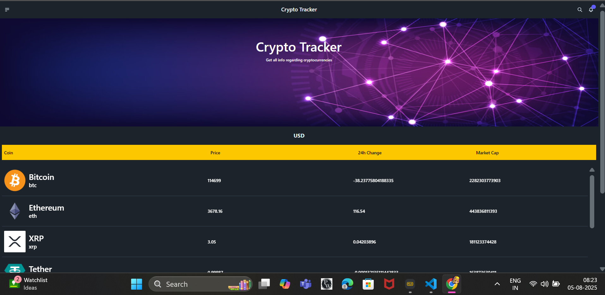
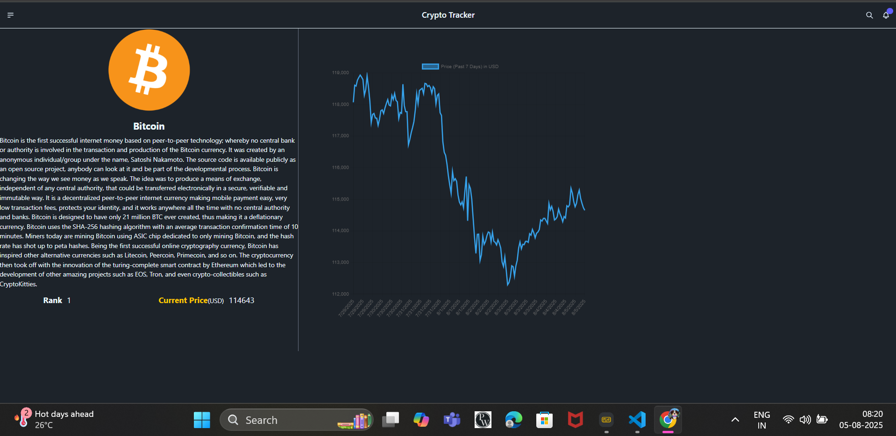

Here’s a tailored README.md for your CryptoTracker project, based on your description:

---
[Deploy Link](https://crypto-tracker-psi-kohl.vercel.app/)
# CryptoTracker

CryptoTracker is a React application for tracking cryptocurrency prices, 24-hour changes, market capitalization, and other key details. The app fetches live data from an API and displays it in a paginated table, making it easy to monitor various coins and their performance.

## Features

- Live cryptocurrency prices
- 24-hour price change and market cap tracking
- Displays coin name and symbol
- Pagination with next/previous navigation
- Data fetching via API
- Built with React, Vite, Tailwind CSS, and DaisyUI

## Tech Stack

- React
- Vite
- Tailwind CSS
- DaisyUI

## Getting Started

### Prerequisites

- Node.js (v14 or higher)
- npm or yarn

### Installation

```bash
git clone https://github.com/ypramod25/CryptoTracker.git
cd CryptoTracker
npm install
```

### Running the App

```bash
npm run dev
```

The app should now be running at http://localhost:5173

## Usage

- View a list of cryptocurrencies with their current price, 24h change, and market cap.
- Use pagination controls to navigate through the list.
- Data updates automatically via API calls.

## Customization

- Update API endpoints or add more features as needed.
- Style with Tailwind and DaisyUI classes for a customized UI.

## License

MIT

---





